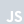
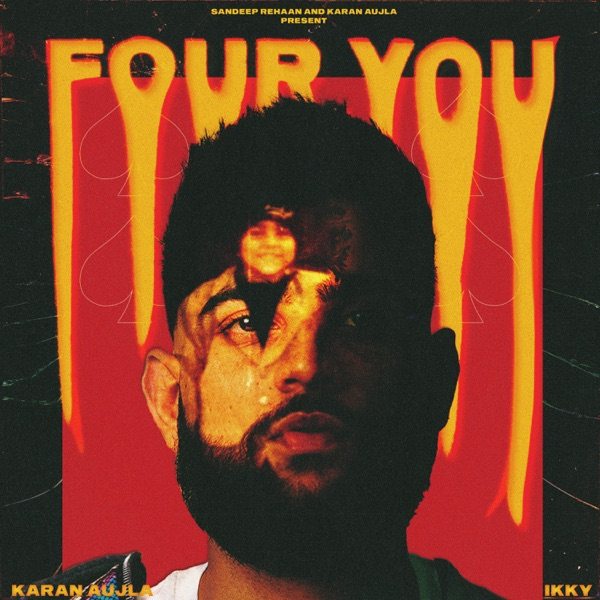
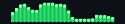

<h1 align="center">Hey, I’m Vivek.</h1>

I build AI-native systems, mostly around agentic AI, LLM applications, machine learning, and backend systems. I like taking an interesting idea, figuring out what makes it work, and building it into something people can actually use.

When the idea calls for it, I go full stack too. APIs, databases, backend services, frontend, UI/UX, whatever the project needs to become a proper product.

And honestly, AI is a pretty fun field to be building in right now. New models keep dropping, frameworks keep changing, and the definition of “best” seems to have a half-life of about two weeks. I like keeping up with it, trying things out, and figuring out what’s actually worth building with.

---

<em>Selected Builds</em>

#### [HITMAN.ai](https://github.com/vivek-i8/hitman-ai)
An AI agent for financial exceptions that investigates payment issues, reasons over evidence, validates proposed resolutions, and executes authorised actions.  
 Python &nbsp;·&nbsp;  LangGraph &nbsp;·&nbsp;  Temporal &nbsp;·&nbsp;  PostgreSQL

#### [SkySense AI](https://github.com/vivek-i8/skysense-ai)
A weather intelligence platform combining forecasting, a conversational assistant, and a full-stack web application.  
 Python &nbsp;·&nbsp;  FastAPI &nbsp;·&nbsp;  React &nbsp;·&nbsp;  TypeScript &nbsp;·&nbsp;  Groq

#### [Vaani](https://github.com/vivek-i8/vaani-voice-authenticity)
A voice authenticity system combining Wav2Vec2 embeddings and acoustic features to detect AI-generated voice clones.  
 PyTorch &nbsp;·&nbsp;  Wav2Vec2 &nbsp;·&nbsp;  FastAPI &nbsp;·&nbsp;  React

#### [SentinAI](https://github.com/vivek-i8/sentin-ai)
A browser security assistant that analyses webpages for suspicious language and risky requests.  
 Python &nbsp;·&nbsp; NLP &nbsp;·&nbsp;  FastAPI &nbsp;·&nbsp;  Chrome Extension

#### [Lumina](https://github.com/vivek-i8/Lumina-Movie-Engine)
A semantic movie recommendation engine using sentence embeddings and deterministic reranking.  
 Python &nbsp;·&nbsp;  Sentence Transformers &nbsp;·&nbsp;  Streamlit

---

<em>Built With</em>

   Python &nbsp;&nbsp;·&nbsp;&nbsp;
   TypeScript &nbsp;&nbsp;·&nbsp;&nbsp;
   JavaScript &nbsp;&nbsp;·&nbsp;&nbsp;
   SQL &nbsp;&nbsp;·&nbsp;&nbsp;
   PyTorch &nbsp;&nbsp;·&nbsp;&nbsp;
   Transformers &nbsp;&nbsp;·&nbsp;&nbsp;
   scikit-learn

   FastAPI &nbsp;&nbsp;·&nbsp;&nbsp;
   React &nbsp;&nbsp;·&nbsp;&nbsp;
   PostgreSQL &nbsp;&nbsp;·&nbsp;&nbsp;
   Docker &nbsp;&nbsp;·&nbsp;&nbsp;
   AWS &nbsp;&nbsp;·&nbsp;&nbsp;
   Git

---

<em>my version of caffeine</em>

  <table>
    <tr>
      <td valign="middle">
        
      </td>
      <td valign="middle" align="left">
        <b>52 Bars</b> 
        Karan Aujla  
         
        <a href="https://open.spotify.com/track/6rFckZb1cuJYzsZiGHgqks">↗ Spotify</a>
      </td>
    </tr>
  </table>

---

  always building &nbsp;·&nbsp; always learning 
  <a href="https://github.com/vivek-i8">GitHub</a> &nbsp;·&nbsp; <a href="https://www.linkedin.com/in/vivekkumawat18">LinkedIn</a> &nbsp;·&nbsp; <a href="https://vivekkumawat-portfolio.vercel.app">Website</a> &nbsp;·&nbsp; <a href="mailto:vivekk.codes@gmail.com">Email</a>

